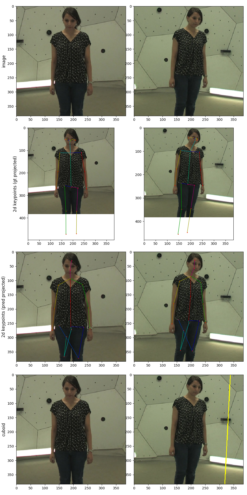
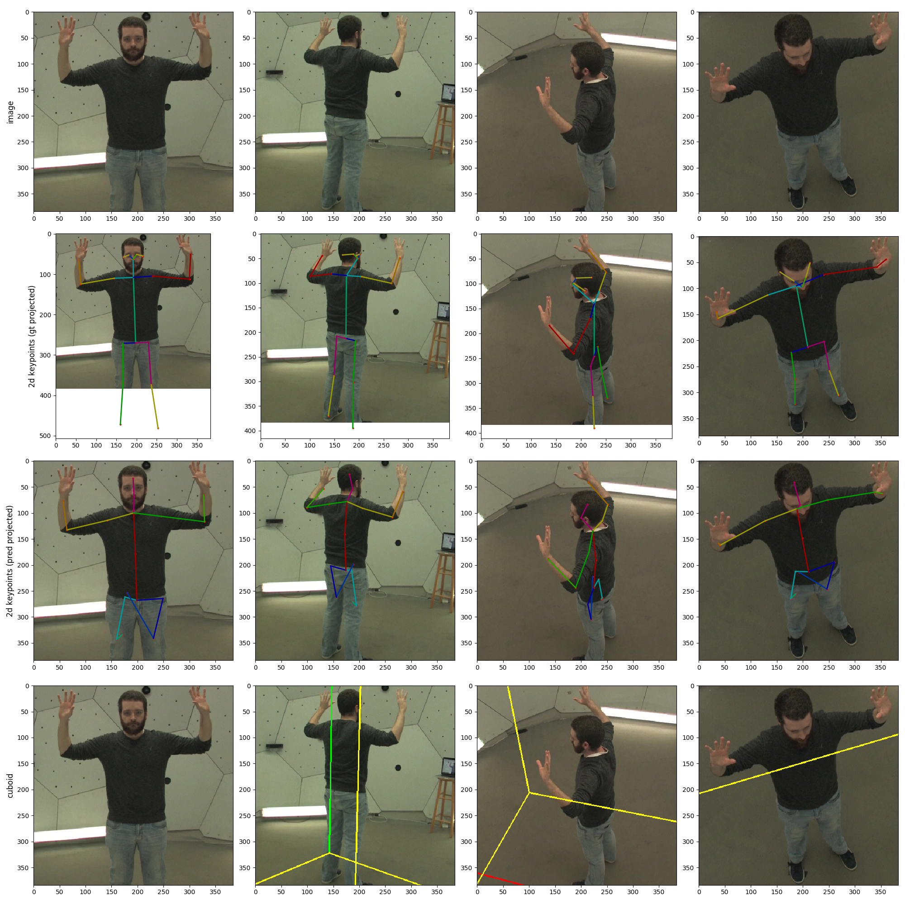

# CMU Dataset Evaluation Results

I was able to successfully test the CMU dataset using the pretrained weights for Human3.6M, with the volumetric triangulation algorithm. There was some discussion on the various issues [here](https://github.com/karfly/learnable-triangulation-pytorch/issues/75) and [here](https://github.com/karfly/learnable-triangulation-pytorch/issues/76). I am currently working on training the CMU panoptic studio dataset.

## Evaluation (H36M weights)

Below are some pictures of the evaluation results for the **volumetric triangulation** algorithm, using the **pretrained Human3.6M weights**. Because the resulting poses are in the H36M format (17 joints) instead of the CMU one (19 joints), we are unable to get a MPJPE evaluation result. Hence, all you can see are pictures. Even then, the algorithm performs quite well.

It is important to note that for the volumetric triangulation algorithm, a ground truth or predicted 3D position of the pelvis is needed to construct the cubiod surrounding the body. In our case, we used the **ground truth** pelvis positions.

Interestingly, the algorithm worked quite well (visually) despite the transfer from H36M to CMU. However, there is an issue with the algorithm when not all cameras show the full body, as the algorithm tends to think the truncated legs are the bottom of the picture. More disucssion [here](https://github.com/karfly/learnable-triangulation-pytorch/issues/75).

### All cameras showing full body

### Some cameras not showing full body

