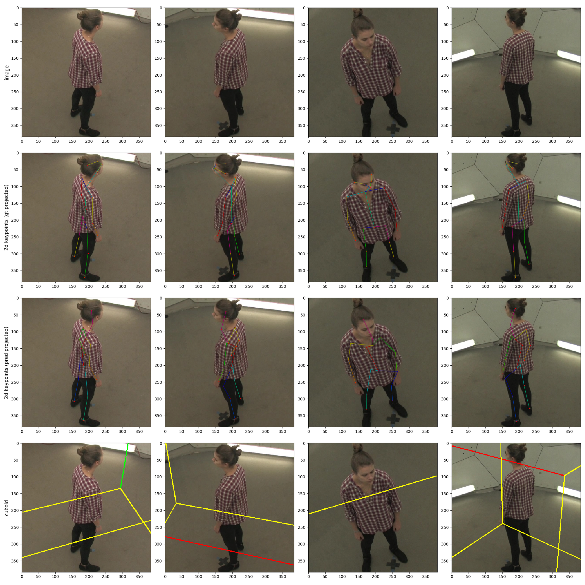

[](https://paperswithcode.com/sota/3d-human-pose-estimation-on-human36m?p=190505754)

# Learnable Triangulation of Human Pose

This repository aims to extend the capabilities of the [original repository](https://github.com/karfly/learnable-triangulation-pytorch) with the **CMU dataset**. See **[here](#cmu-panoptic)** for more details! Also see the [**preliminary results here**](CMU_EVAL_RESULTS.md). 

For your convenience, I have been regularly updating the [wiki page](https://github.com/Samleo8/learnable-triangulation-pytorch/wiki) if you would like to see details specific to the CMU dataset. Feel free to check out my [personal website](https://samleo8.github.io/research/index.html#evaluating-multi-view-human-pose-estimation-algorithm-on-cmu-panoptic-studio-and-other-datasets-) for reflections and overview of this project!

 


---

The [original repository](https://github.com/karfly/learnable-triangulation-pytorch) is the official PyTorch implementation of the paper ["Learnable Triangulation of Human Pose"](https://arxiv.org/abs/1905.05754) (ICCV 2019, oral). Here we tackle the problem of 3D human pose estimation from multiple cameras. We present 2 novel methods — Algebraic and Volumetric learnable triangulation — that **outperform** previous state of the art.

If you find a bug, have a question or know to improve the code - please open an issue!

:arrow_forward: [ICCV 2019 talk](https://youtu.be/zem03fZWLrQ?t=3477)

<p align="center">
  <a href="http://www.youtube.com/watch?v=z3f3aPSuhqg">
    
  </a>
</p>

# How to use
<<<<<<< HEAD

This project doesn't have any special or difficult-to-install dependencies. All installation can be down with:

=======
This project doesn't have any special or difficult-to-install dependencies. All installation can be done with:
>>>>>>> 1ba239618593f95f412444e4933433dd49003830
```bash
pip install -r requirements.txt
```

## Data
<<<<<<< HEAD

*Note:* only [Human3.6M](http://vision.imar.ro/human3.6m/description.php) dataset training/evaluation is available right now. [CMU Panoptic](http://domedb.perception.cs.cmu.edu/) dataset will be added soon.
=======
Sorry, only [Human3.6M](http://vision.imar.ro/human3.6m/description.php) dataset training/evaluation is available right now. We cannot add [CMU Panoptic](http://domedb.perception.cs.cmu.edu/), sorry for that.
>>>>>>> 1ba239618593f95f412444e4933433dd49003830

**UPDATE:** Evaluation of the CMU Panoptic Studio Dataset is no longer WIP. I have been able to successfully test the dataset based on pre-trained weights from Human3.6M, and the volumetric triangulation algorithm. More discussion [here](https://github.com/karfly/learnable-triangulation-pytorch/issues/75) and results [here](CMU_EVAL_RESULTS.md). Currently working on the training of the CMU dataset!

**UPDATE:** You can now download pretrained labels and data from my Google drive [here](https://drive.google.com/drive/folders/1WkLo1k-ZLqaWm02alvl82OiuRNWG_7Kq?usp=sharing), with supplementary data and weights from the original author's Google drive [here](https://drive.google.com/open?id=1TGHBfa9LsFPVS5CH6Qkcy5Jr2QsJdPEa) 

#### Human3.6M

1. Download and preprocess the dataset by following the instructions in [mvn/datasets/human36m_preprocessing/README.md](https://github.com/karfly/learnable-triangulation-pytorch/blob/master/mvn/datasets/human36m_preprocessing/README.md).
2. Download pretrained backbone's weights from [here](https://disk.yandex.ru/d/hv-uH_7TY0ONpg) and place them here: `./data/pretrained/human36m/pose_resnet_4.5_pixels_human36m.pth` (ResNet-152 trained on COCO dataset and finetuned jointly on MPII and Human3.6M).
3. If you want to train Volumetric model, you need rough estimations of the pelvis' 3D positions both for train and val splits. In the paper we estimate them using the Algebraic model. You can use the [pretrained](#model-zoo) Algebraic model to produce predictions or just take [precalculated 3D skeletons](#model-zoo).

#### CMU Panoptic

1. Download and preprocess the dataset by following the instructions in [mvn/datasets/cmu_preprocessing/README.md](https://github.com/Samleo8/learnable-triangulation-pytorch/blob/master/mvn/datasets/cmu_preprocessing/README.md).
2. The config files can be found at `$THIS_REPOSITORY/experiements/[train|eval]/cmupanoptic`
3. You can also do a quick evaluation using the provided `./eval_cmu` script
4. You can view preliminary results [here](CMU_EVAL_RESULTS.md)

#### General Datasets

I tried to create documentation on how you can [setup](https://github.com/Samleo8/learnable-triangulation-pytorch/blob/master/SETUP_GENERAL_DATASET.md), [test](https://github.com/Samleo8/learnable-triangulation-pytorch/blob/master/TESTING_ON_GENERAL_DATASET.md) and [train](https://github.com/Samleo8/learnable-triangulation-pytorch/blob/master/tRAINING_ON_GENERAL_DATASET.md) your own general dataset. You can also refer to the wiki pages for [setup](https://github.com/Samleo8/learnable-triangulation-pytorch/wiki/Setup-for-General-Datasets) and [testing/training]. 

I was able to evaluate the CMU Panoptic dataset using the same ideas, and an example of that is seen above [here](#cmu-panoptic). I'm also working on testing the CMU Panoptic dataset which does not have ground truth.

## Model zoo
<<<<<<< HEAD

In this section we collect pretrained models and configs. All **pretrained weights** and **precalculated 3D skeletons** can be downloaded at once [from here](https://drive.google.com/drive/folders/1yjnD47hdcFNvbQj87pXDgqGt52K7rz_z) and placed to `./data/pretrained`, so that eval configs can work out-of-the-box (without additional setting of paths). Alternatively, the table below provides separate links to those files.
=======
In this section we collect pretrained models and configs. All **pretrained weights** and **precalculated 3D skeletons** can be downloaded at once [from here](https://disk.yandex.ru/d/jbsyN8XVzD-Y7Q) and placed to `./data/pretrained`, so that eval configs can work out-of-the-box (without additional setting of paths). Alternatively, the table below provides separate links to those files.
>>>>>>> 1ba239618593f95f412444e4933433dd49003830

**Human3.6M:**

| Model                | Train config                                                                                                                                                  | Eval config                                                                                                                                                 | Weights                                                                                    | Precalculated results                                                                                                                                  | MPJPE (relative to pelvis), mm |
|----------------------|:--------------------------------------------------------------------------------------------------------------------------------------------------------------|:------------------------------------------------------------------------------------------------------------------------------------------------------------|:------------------------------------------------------------------------------------------:|:------------------------------------------------------------------------------------------------------------------------------------------------------:|-------------------------------:|
| Algebraic            |         [train/human36m_alg.yaml](https://github.com/karfly/learnable-triangulation-pytorch/blob/master/experiments/human36m/train/human36m_alg.yaml)         |         [eval/human36m_alg.yaml](https://github.com/karfly/learnable-triangulation-pytorch/blob/master/experiments/human36m/eval/human36m_alg.yaml)         | [link](https://disk.yandex.ru/d/3TJMKaa6iKaymw) | [train](https://disk.yandex.ru/d/2Gwk7JZ_QWpFvw), [val](https://disk.yandex.ru/d/ZsQ4GV5EX_Wsog)  | 22.5                           |
| Volumetric (softmax) | [train/human36m_vol_softmax.yaml](https://github.com/karfly/learnable-triangulation-pytorch/blob/master/experiments/human36m/train/human36m_vol_softmax.yaml) | [eval/human36m_vol_softmax.yaml](https://github.com/karfly/learnable-triangulation-pytorch/blob/master/experiments/human36m/eval/human36m_vol_softmax.yaml) | [link](https://disk.yandex.ru/d/MvD3orcBc6wqRA) |                                               —                                                                                                        | **20.4**                       |

**CMU Panoptic Studio:**

| Model                | Train config                                                                                                                                                  | Eval config                                                                                                                                                 | Weights                                                                                    | Precalculated results                                                                                                                                  | MPJPE (relative to pelvis), mm |
|----------------------|:--------------------------------------------------------------------------------------------------------------------------------------------------------------|:------------------------------------------------------------------------------------------------------------------------------------------------------------|:------------------------------------------------------------------------------------------:|:------------------------------------------------------------------------------------------------------------------------------------------------------:|-------------------------------:|
| Algebraic            |         [train/cmu_alg.yaml](https://github.com/Samleo8/learnable-triangulation-pytorch/blob/master/experiments/cmupanoptic/train/cmu_alg.yaml)         |         [eval/cmu_alg.yaml](https://github.com/karfly/learnable-triangulation-pytorch/blob/master/experiments/cmupanoptic/eval/cmu_alg.yaml)         | - | -  | ??                           |
| Volumetric (softmax) | [train/cmu_vol_softmax.yaml](https://github.com/Samleo8/learnable-triangulation-pytorch/blob/master/experiments/cmupanoptic/train/cmu_vol_softmax.yaml) | [eval/cmu_vol_softmax.yaml](https://github.com/Samleo8/learnable-triangulation-pytorch/blob/master/experiments/cmupanoptic/eval/cmu_vol_softmax.yaml) | - |                                               —                                                                                                        | ??                       |

## Train

Every experiment is defined by `.config` files. Configs with experiments from the paper can be found in the `./experiments` directory (see [model zoo](#model-zoo)).

#### Single-GPU

To train a Volumetric model with softmax aggregation using **1 GPU**, run:

```bash
python3 train.py \
  --config experiments/human36m/train/human36m_vol_softmax.yaml \
  --logdir ./logs
```

The training will start with the config file specified by `--config`, and logs (including tensorboard files) will be stored in `--logdir`.

#### Multi-GPU (*in testing*)

Multi-GPU training is implemented with PyTorch's [DistributedDataParallel](https://pytorch.org/docs/stable/nn.html#distributeddataparallel). It can be used both for single-machine and multi-machine (cluster) training. To run the processes use the PyTorch [launch utility](https://github.com/pytorch/pytorch/blob/master/torch/distributed/launch.py).

To train a Volumetric model with softmax aggregation using **2 GPUs on single machine**, run:

```bash
python3 -m torch.distributed.launch --nproc_per_node=2 --master_port=2345 \
  train.py  \
  --config experiments/human36m/train/human36m_vol_softmax.yaml \
  --logdir ./logs
```

## Tensorboard

To watch your experiments' progress, run tensorboard:

```bash
tensorboard --logdir ./logs
```

Alternatively, use the script

```bash
./scripts/startTensorboard [logs-dir (./logs by default)]
```

which also overcomes `PermissionError` due to `/tmp` directory being blocked

You can also [visualise the results without tensorboard](#visualising-results-without-tensorboard).

## Evaluation

After training, you can evaluate the model. Inside the same config file, add path to the learned weights (they are dumped to `logs` dir during training):

```yaml
model:
    init_weights: true
    checkpoint: {PATH_TO_WEIGHTS}
```

Also, you can change other config parameters like `retain_every_n_frames_test`.

For H36M, run:

```bash
python3 train.py \
  --eval --eval_dataset val \
  --config experiments/human36m/eval/human36m_vol_softmax.yaml \
  --logdir ./logs
```

or simply,

```bash
./scripts/eval_h36m
```

For CMU, run

```bash
python3 train.py \
  --eval --eval_dataset val \
  --config experiments/human36m/eval/human36m_vol_softmax.yaml \
  --logdir ./logs
```

or simply,

```bash
./scripts/eval_cmu
```

Argument `--eval_dataset` can be `val` or `train`. Results can be seen in `logs` directory or in the tensorboard.

Alternatively, after all the pre-processing steps above have been completed, for a quick evaluation of the datasets, you can run the `./scripts/eval_cmu` and `./scripts/eval_human36m` scripts.

**IMPORTANT NOTE:** There is a bug with the old Python version where `multiprocessing` connections are unable to send more than 2 Gb of data. This is fixed in a pull request for new Python versions [here](https://github.com/python/cpython/pull/10305).

Therefore, you may possible run into `MemoryError`s if running on Linux machines with Python versions < 3.8. The fix to this is to modify the `multiprocessing` library's `connection.py` file with the updated file [here](https://github.com/python/cpython/blob/bccacd19fa7b56dcf2fbfab15992b6b94ab6666b/Lib/multiprocessing/connection.py), which is from the aforementioned [pull request](https://github.com/python/cpython/pull/10305).

*It is advised that you create a backup of the old `connection.py` file in case something goes wrong.*

*Example of where to find the file:*

* If using virtual environment: `~/.pyenv/versions/<your_python_version>/lib/python<python_version>/connection.py`
* Otherwise: `/usr/lib/python<python_version>/multiprocessing`*

## Visualising Results (without Tensorboard)

A python script `visualise_results.py` has been created to allow you to better view (and play with) the predicted 3D keypoints after [testing/evaluation](#evaluation). After evaluation, a `results.pkl` file will be saved to `./logs/<experiment-name>/checkpoints/<checkpoint_number>/results.pkl`. For example, `./logs/eval_cmu_vol_softmax_VolumetricTriangulationNet@17.05.20-15:13:24/checkpoints/0000/results.pkl`.

To use the script, you will need the aforementioned pickle file, and the config file used in the original experiment, also located conveniently in the `./logs/<experiment-name>/` folder.

```bash
python3 visualise_results.py <results_pkl_file> <config_yaml_file_used_in_experiment> [n_images_step=1 [save_images_instead=0]]
```

You can choose to save the images instead of viewing them via OpenCV viewer. If so, images are saved to a new directory `saved_images`, in the directory where `results_pkl_file` is found.

Feel free to modify the various parameters of the script (such as which camera views to project onto).

# Results

* We conduct experiments on two available large multi-view datasets: Human3.6M [\[2\]](#references) and CMU Panoptic [\[3\]](#references).
* The main metric is **MPJPE** (Mean Per Joint Position Error) which is L2 distance averaged over all joints.

## Human3.6M

* We significantly improved upon the previous state of the art (error is measured relative to pelvis, without alignment).
* Our best model reaches **17.7 mm** error in absolute coordinates, which was unattainable before.
* Our Volumetric model is able to estimate 3D human pose using **any number of cameras**, even using **only 1 camera**. In single-view setup, we get results comparable to current state of the art [\[6\]](#references) (49.9 mm vs. 49.6 mm).

<br>
MPJPE relative to pelvis:

|                             	|  MPJPE (averaged across all actions), mm	|
|-----------------------------	|:--------:	|
| Multi-View Martinez [\[4\]](#references)          |   57.0   	|
| Pavlakos et al. [\[8\]](#references)   	          |   56.9   	|
| Tome et al. [\[4\]](#references)                 	|   52.8   	|
| Kadkhodamohammadi & Padoy [\[5\]](#references)   	|   49.1   	|
| [Qiu et al.](https://github.com/microsoft/multiview-human-pose-estimation-pytorch) [\[9\]](#references)   	|   26.2   	|
| RANSAC (our implementation) 	|   27.4   	|
| **Ours, algebraic**          	|   22.4   	|
| **Ours, volumetric**         	| **20.5** 	|

<br>
MPJPE absolute (scenes with invalid ground-truth annotations are excluded):

|                             	|  MPJPE (averaged across all actions), mm 	|
|-----------------------------	|:--------:	|
| RANSAC (our implementation) 	|   22.8   	|
| **Ours, algebraic**          	|   19.2   	|
| **Ours, volumetric**         	| **17.7** 	|

<br>
MPJPE relative to pelvis (single-view methods):

|                             	| MPJPE (averaged across all actions), mm 	|
|-----------------------------	|:-----------------------------------:	|
| Martinez et al. [\[7\]](#references)                  	|                 62.9               	|
| Sun et al. [\[6\]](#references)                  	|                 **49.6**                	|
| **Ours, volumetric single view** 	|                 **49.9**                	|

## CMU Panoptic

* Our best model reaches **13.7 mm** error in absolute coordinates for 4 cameras
* We managed to get much smoother and more accurate 3D pose annotations compared to dataset annotations (see [video demonstration](http://www.youtube.com/watch?v=z3f3aPSuhqg))

<br>
MPJPE relative to pelvis [4 cameras]:

|                             	|  MPJPE, mm 	|
|-----------------------------	|:--------:	|
| RANSAC (our implementation) 	|   39.5   	|
| **Ours, algebraic**          	|   21.3   	|
| **Ours, volumetric**         	| **13.7** 	|

# Method overview

We present 2 novel methods of learnable triangulation: Algebraic and Volumetric.

## Algebraic


Our first method is based on Algebraic triangulation. It is similar to the previous approaches, but differs in 2 critical aspects:

1. It is **fully differentiable**. To achieve this, we use soft-argmax aggregation and triangulate keypoints via a differentiable SVD.
2. The neural network additionally predicts **scalar confidences for each joint**, passed to the triangulation module, which successfully deals with outliers and occluded joints.

For the most popular Human3.6M dataset, this method already dramatically reduces error by **2.2 times (!)**, compared to the previous art.

## Volumetric


In Volumetric triangulation model, intermediate 2D feature maps are densely unprojected to the volumetric cube and then processed with a 3D-convolutional neural network. Unprojection operation allows **dense aggregation from multiple views** and the 3D-convolutional neural network is able to model **implicit human pose prior**.

Volumetric triangulation additionally improves accuracy, drastically reducing the previous state-of-the-art error by **2.4 times!** Even compared to the best parallelly developed [method](https://github.com/microsoft/multiview-human-pose-estimation-pytorch) by MSRA group, our method still offers significantly lower error of **21 mm**.

<p align="center">
  
</p>

# Cite us!

```bibtex
@inproceedings{iskakov2019learnable,
  title={Learnable Triangulation of Human Pose},
  author={Iskakov, Karim and Burkov, Egor and Lempitsky, Victor and Malkov, Yury},
  booktitle = {International Conference on Computer Vision (ICCV)},
  year={2019}
}
```

# Contributors

* [Karim Iskakov](https://github.com/karfly)
* [Egor Burkov](https://github.com/shrubb)
* [Victor Lempitsky](https://scholar.google.com/citations?user=gYYVokYAAAAJ&hl=ru)
* [Yury Malkov](https://github.com/yurymalkov)
* [Rasul Kerimov](https://github.com/rrkarim)
* [Ivan Bulygin](https://github.com/blufzzz)

# News

* **26 Nov 2019:** Updataed [precalculated results](#model-zoo) (see [this issue](https://github.com/karfly/learnable-triangulation-pytorch/issues/37)).
* **18 Oct 2019:** Pretrained models (algebraic and volumetric) for Human3.6M are released.
* **8 Oct 2019:** Code is released!

# References

* [\[1\]](#references) R. Hartley and A. Zisserman. **Multiple view geometry in computer vision**.
* [\[2\]](#references) C. Ionescu, D. Papava, V. Olaru, and C. Sminchisescu. **Human3.6m: Large scale datasets and predictive methods for 3d human sensing in natural environments**.
* [\[3\]](#references) H. Joo, T. Simon, X. Li, H. Liu, L. Tan, L. Gui, S. Banerjee, T.  S. Godisart, B. Nabbe, I. Matthews, T. Kanade,S. Nobuhara, and Y. Sheikh. **Panoptic studio: A massively multiview system for social interaction capture**.
* [\[4\]](#references) D. Tome, M. Toso, L. Agapito, and C. Russell.  **Rethinking Pose in 3D: Multi-stage Refinement and Recovery for Markerless Motion Capture**.
* [\[5\]](#references) A. Kadkhodamohammadi and N. Padoy. **A generalizable approach for multi-view 3D human pose regression**.
* [\[6\]](#references) X. Sun, B. Xiao, S. Liang, and Y. Wei. **Integral human pose regression**.
* [\[7\]](#references) J. Martinez, R. Hossain, J. Romero, and J. J. Little. **A simple yet effective baseline for 3d human pose estimation**.
* [\[8\]](#references) G. Pavlakos, X. Zhou, K. G. Derpanis, and  K. Daniilidis. **Harvesting multiple views for marker-less 3D human pose annotations**.
* [\[9\]](#references) H. Qiu, C. Wang, J. Wang, N. Wang and W. Zeng. (2019). **Cross View Fusion for 3D Human Pose Estimation**, [GitHub](https://github.com/microsoft/multiview-human-pose-estimation-pytorch)
